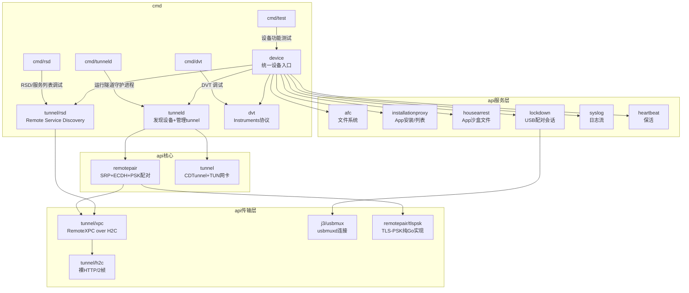
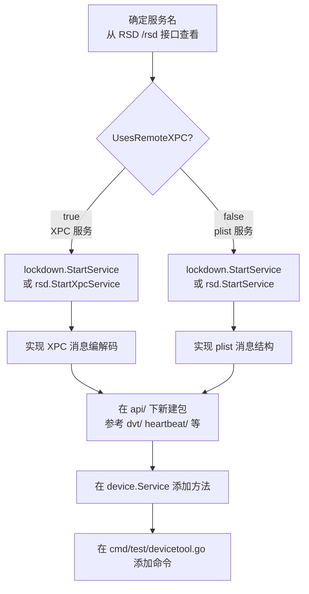
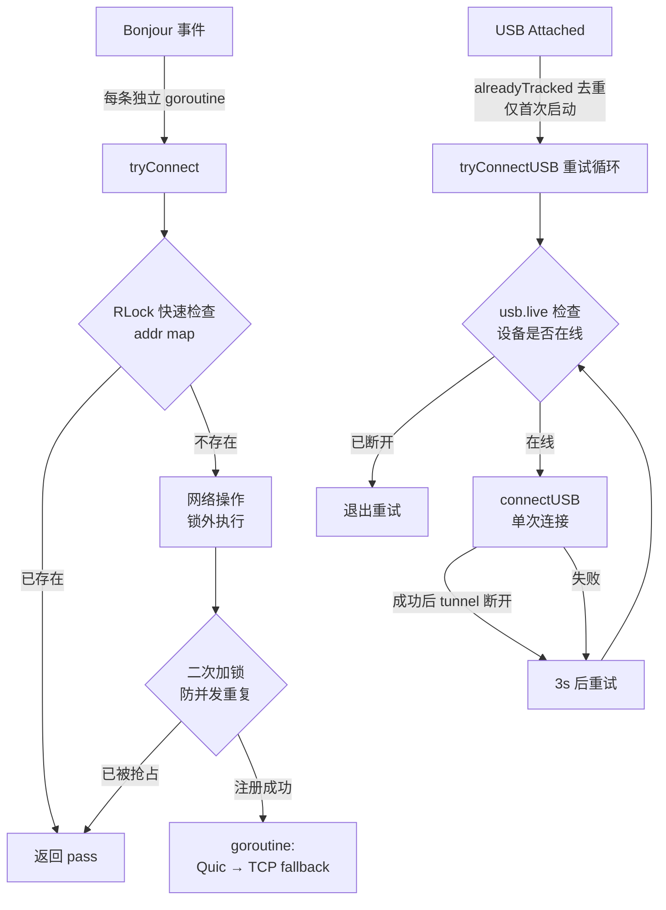

# j3idevice 开发维护与使用指南

Go module: `github.com/larryhou/j3idevice`，最低 Go 版本 1.23。

---

## 包结构总览



---

## 快速上手

### 前置条件

```bash
# 需要 sudo 权限创建 TUN 网卡
# 设备需已与 Mac 完成 lockdown 配对（iTunes 或 Finder 信任过）
go version   # >= 1.23
```

### 启动 tunneld

```bash
# 编译
go build -o /tmp/j3tunneld ./cmd/tunneld/

# 运行（需要 sudo 创建 utun 接口）
sudo /tmp/j3tunneld

# 验证 tunnel 已建立
curl http://localhost:33333/rsd
curl http://localhost:33333/rsd/<UDID>
```

### tunneld HTTP API

| 端点 | 说明 |
|---|---|
| `GET /rsd` | 列出所有已建立 tunnel 的设备 |
| `GET /rsd/:udid` | 查询指定设备的 RSD 地址（`[IPv6]:port`） |

tunneld 同时监听 `localhost:33334`（pprof 性能分析）。

---

## 设备 API 使用

### 获取 device.Service

```go
// 自动选择：USB 优先，无 USB 则走 tunneld
dev, err := device.New(device.Any)

// 指定 UDID
dev, err := device.New("00008130-001975122140001C")

// 直接从 tunneld 拿（跳过 USB 检测）
dev, err := device.NewFromTunnelD("00008130-001975122140001C")
```

**版本路由规则**（`device.go:134`）：
- iOS < 17 → lockdown（USB mTLS）
- iOS ≥ 17 → tunneld RSD 路径

### 常用功能

```go
// 截图
data, err := dev.ScreenShot()
os.WriteFile("screen.png", data, 0644)

// 拉起 App
pid, err := dev.Launch("com.apple.mobilesafari", processctrl.LaunchContext{})

// 杀进程
err := dev.Kill(pid)

// 列出进程
procs, err := dev.ListProcesses()

// 列出已安装 App
apps, err := dev.ListApplications()   // map[bundleID]*Application

// 安装 ipa
err := dev.Install("/path/to/app.ipa")

// 卸载
err := dev.Uninstall("com.example.app")

// 读取设备系统文件 (AFC)
afcSvc, err := dev.AfcService()
items, err := afcSvc.List("DCIM/", true)

// 读取 App 沙盒文件 (HouseArrest)
hasSvc, err := dev.HouseArrestService()
afcSvc, err := hasSvc.AfcService("com.example.app")
items, err := afcSvc.List("/Documents/", true)

// 实时日志
err := dev.Logcat(os.Stdout)

// 端口转发
err := dev.Forward(localPort, devicePort)
```

### 直接用 devicetool

```bash
go run cmd/test/devicetool.go -command launch       -bundle com.apple.mobilesafari
go run cmd/test/devicetool.go -command launchAndReturn -bundle com.example.app
go run cmd/test/devicetool.go -command kill         -bundle com.example.app
go run cmd/test/devicetool.go -command install      -path /tmp/app.ipa
go run cmd/test/devicetool.go -command uninstall    -bundle com.example.app
go run cmd/test/devicetool.go -command pull         -bundle com.example.app -path /Documents/file.dat -path /tmp/file.dat
go run cmd/test/devicetool.go -command push         -bundle com.example.app -path /tmp/file.dat -path /Documents/file.dat
go run cmd/test/devicetool.go -command remove       -bundle com.example.app -path /Documents/file.dat
```

---

## 新增设备服务



**iOS 17+ 服务名规范**（在 `api/tunnel/rsd/svc.go`）：
- 普通 plist 服务：`com.apple.xxx.shim.remote`
- XPC 服务：`UsesRemoteXPC: true`（如 `com.apple.instruments.dtservicehub`）

```go
// plist 服务示例
svc, err := lockdown.StartService("com.apple.mobile.heartbeat.shim.remote")
// 或通过 RSD
svc, err := rsd.StartService("com.apple.mobile.heartbeat.shim.remote")

// XPC 服务示例
xpcConn, err := rsd.StartXpcService("com.apple.instruments.dtservicehub")
```

---

## 测试

### 单元测试（无需设备）

```bash
# PSK 实现验证（包含 OpenSSL 互操作性测试）
go test ./api/remotepair/ -v -run TestPSKConn -timeout 20s

# XPC 编解码测试
go test ./api/tunnel/xpc/ -v

# 所有单元测试
go test ./api/remotepair/ ./api/tunnel/xpc/
```

### 真机集成测试

```bash
# 需要先启动 tunneld
sudo /tmp/j3tunneld &

# 截图测试
go run cmd/test/test.go
ls -lh test.png   # 验证截图尺寸

# launch/kill 测试
go run cmd/test/devicetool.go -command launchAndReturn -bundle com.apple.mobilesafari
go run cmd/test/devicetool.go -command kill -bundle com.apple.mobilesafari

# 验证 PSK tunnel 日志关键字
# 正常输出应包含：
# CONNECT [设备IPv6]:端口
# PSK TLS_PSK_WITH_AES_256_GCM_SHA384 handshake OK [设备IPv6]:端口
# TUNNEL STARTED [设备IPv6]:58783
```

### 验证 PSK 无 CGo 依赖

```bash
CGO_ENABLED=0 go build ./api/remotepair/ && echo "纯Go，无CGo依赖"
```

---

## 已知问题与注意事项

### cmd/test 双 main 冲突

`cmd/test/` 下有 `test.go` 和 `devicetool.go` 两个文件都声明了 `main`，直接 `go build ./cmd/test/` 会报错。分别用 `go run` 指定文件：

```bash
go run cmd/test/test.go           # 截图 + ListApplications
go run cmd/test/devicetool.go     # launch/kill/install 等
```

### installationproxy UIRequiredDeviceCapabilities

iOS 26+ 某些系统 App 的 `UIRequiredDeviceCapabilities` 字段从 `[]string` 变为 `string`，已修复为 `any` 类型（`api/installationproxy/message.go:74`）。

### XPC TestDictionary / TestObject 失败

`api/tunnel/xpc/xpc_test.go` 的字典比较用 `!=` 比较 `int` 类型，XPC 解码后 int 类型为 `int64`，比较失败是已知问题，不影响实际功能。

### tunneld 必须 sudo

创建 TUN 网卡（utun）需要 root 权限。开发调试时用 `sudo`，生产部署可用 launchd + plist 配置以 root 运行。

### iOS 版本路由

| iOS 版本 | 路径 | 说明 |
|---|---|---|
| < 17 | lockdown（USB only） | mTLS 配对，无需 tunneld |
| ≥ 17, < 18.2 | tunneld → TCP+PSK 或 QUIC | QUIC 可用 |
| ≥ 18.2 | tunneld → TCP+PSK only | QUIC 已移除，握手返回 `CRYPTO_ERROR 0x128` |

---

## tunneld 并发与健壮性设计



**锁使用规范**（`tunneld.go`）：

| 操作 | 锁类型 | 原因 |
|---|---|---|
| 读 `svcs`/`addr`/`usbTuns` | `RLock` | 并发读安全 |
| 写 `svcs`/`addr`/`usbTuns` | `Lock` | 独占写 |
| 读写 `usb.live`/`usb.udid` | `usb.Mutex` | 独立的 USB 状态锁 |
| 网络连接（`rsd.New` 等） | **无锁** | 耗时操作必须在锁外 |

---

## 调试技巧

```bash
# 查看当前所有 tunnel
curl -s http://localhost:33333/rsd | python3 -m json.tool

# 查看指定设备
curl -s http://localhost:33333/rsd/<UDID> | python3 -m json.tool

# pprof 性能分析
go tool pprof http://localhost:33334/debug/pprof/goroutine

# 查看已配对设备
ls ~/.j3idevice/RP_*.plist

# 强制重新配对（删除 pair record）
rm ~/.j3idevice/RP_<UDID>.plist
```

---

## 目录速查

```
api/
├── afc/              文件系统访问 (Apple File Conduit)
├── bonjour/          mDNS 服务发现
├── device/           统一设备入口 (iOS版本路由)
├── dvt/              Instruments/DVT 协议
│   ├── deviceinfo/   进程列表、目录读取
│   ├── processctrl/  App 启动/停止
│   ├── screenshot/   截图
│   └── ...
├── heartbeat/        连接保活
├── housearrest/      App 沙盒文件访问
├── installationproxy/ App 安装/卸载/列表
├── j3/               基础传输
│   ├── plist/        plist 帧协议
│   └── usbmux/       usbmuxd 连接
├── lockdown/         USB lockdown 配对
├── remotepair/       CoreDevice 配对 + PSK
│   ├── tlspsk.go     纯Go TLS-PSK 实现
│   └── pskconn.go    NewPSKConn 入口
├── syslog/           设备日志流
├── tunnel/           CDTunnel + TUN 网卡
│   ├── h2c/          裸 HTTP/2 帧
│   ├── rsd/          Remote Service Discovery
│   └── xpc/          RemoteXPC 协议
├── tunneld/          隧道守护进程
└── util/             工具函数

cmd/
├── tunneld/          tunneld 入口 (sudo 运行)
├── test/             设备功能测试
│   ├── test.go       截图 + 应用列表
│   └── devicetool.go launch/kill/install/pull/push
├── rsd/              RSD 调试 + 服务列表
└── dvt/              DVT 调试
```
