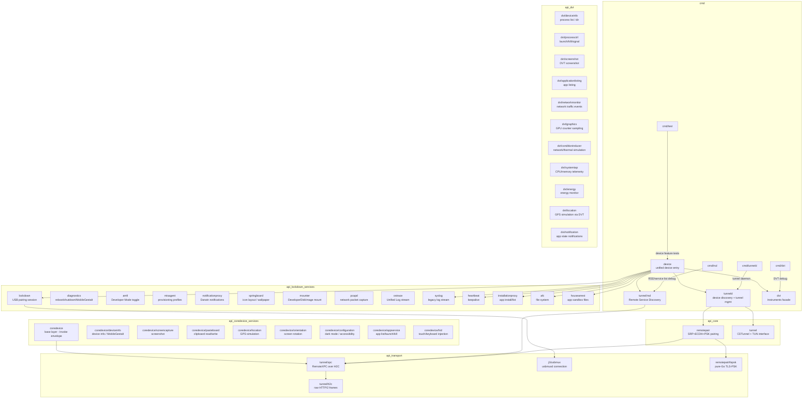
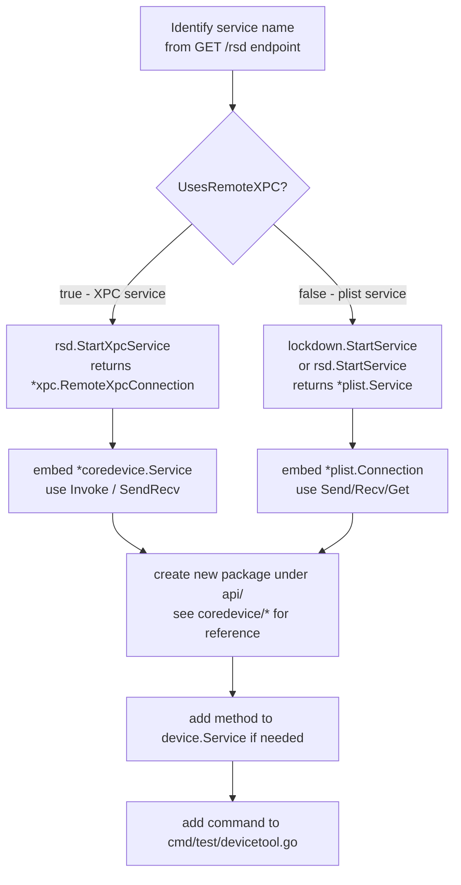
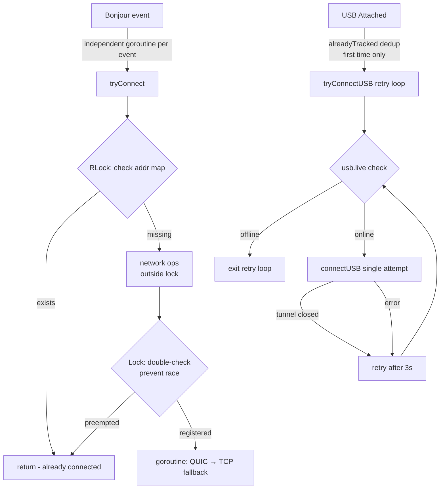

# j3idevice Development & Maintenance Guide

Go module: `github.com/larryhou/j3idevice`, minimum Go 1.23.

---

## Package Structure



---

## Quick Start

### Prerequisites

```bash
# sudo required to create TUN interfaces
# Device must be paired with this Mac (trusted via iTunes/Finder)
go version   # >= 1.23
```

### Start tunneld

```bash
go build -o /tmp/j3tunneld ./cmd/tunneld/
sudo /tmp/j3tunneld

# Verify tunnel is up
curl http://localhost:33333/rsd
curl http://localhost:33333/rsd/<UDID>
```

### tunneld HTTP API

| Endpoint | Description |
|---|---|
| `GET /rsd` | List all devices with active tunnels |
| `GET /rsd/:udid` | Get RSD address (`[IPv6]:port`) for a device |

tunneld also listens on `localhost:33334` for pprof profiling.

---

## Device API Usage

### Obtain device.Service

```go
// Auto-select: USB first, falls back to tunneld
dev, err := device.New(device.Any)

// By UDID
dev, err := device.New("00008130-001975122140001C")

// Directly from tunneld (skip USB detection)
dev, err := device.NewFromTunnelD("00008130-001975122140001C")
```

**Version routing** (`device.go:134`):
- iOS < 17 → lockdown (USB mTLS)
- iOS ≥ 17 → tunneld RSD path

### Common Operations

```go
// Screenshot (DVT path)
data, err := dev.ScreenShot()
os.WriteFile("screen.png", data, 0644)

// Launch app
pid, err := dev.Launch("com.apple.mobilesafari", processctrl.LaunchContext{})

// Kill process
err := dev.Kill(pid)

// List processes
procs, err := dev.ListProcesses()

// List installed apps
apps, err := dev.ListApplications()   // map[bundleID]*Application

// Install ipa
err := dev.Install("/path/to/app.ipa")

// Uninstall
err := dev.Uninstall("com.example.app")

// AFC file access
afcSvc, err := dev.AfcService()
items, err := afcSvc.List("DCIM/", true)

// App sandbox files (HouseArrest)
hasSvc, err := dev.HouseArrestService()
afcSvc, err := hasSvc.AfcService("com.example.app")
items, err := afcSvc.List("/Documents/", true)

// Live syslog
err := dev.Logcat(os.Stdout)
```

### devicetool CLI

```bash
go run cmd/test/devicetool.go -command launch          -bundle com.apple.mobilesafari
go run cmd/test/devicetool.go -command launchAndReturn -bundle com.example.app
go run cmd/test/devicetool.go -command kill            -bundle com.example.app
go run cmd/test/devicetool.go -command install         -path /tmp/app.ipa
go run cmd/test/devicetool.go -command uninstall       -bundle com.example.app
go run cmd/test/devicetool.go -command pull            -bundle com.example.app -path /Documents/file.dat -path /tmp/file.dat
go run cmd/test/devicetool.go -command push            -bundle com.example.app -path /tmp/file.dat -path /Documents/file.dat
go run cmd/test/devicetool.go -command remove          -bundle com.example.app -path /Documents/file.dat
```

---

## Service Implementation Map

All implemented services and their wire protocol:

### Batch 1 — Lockdown Plist Services

| Package | Service Name | Key Operations |
|---|---|---|
| `api/diagnostics` | `com.apple.mobile.diagnostics_relay` | `Restart()`, `Shutdown()`, `Sleep()`, `MobileGestalt(keys...)`, `IORegistryEntry()`, `All()` |
| `api/amfi` | `com.apple.amfi.lockdown` | `Reveal()`, `Enable()`, `Accept()` |
| `api/misagent` | `com.apple.misagent` | `Install(profile)`, `Remove(id)`, `CopyAll()` |
| `api/notificationproxy` | `com.apple.mobile.notification_proxy` | `Post(name)`, `Observe(name)`, `Recv()` |
| `api/springboard` | `com.apple.springboardservices` | `GetIconState()`, `SetIconState()`, `GetIconPNGData(bid)`, `GetInterfaceOrientation()`, `GetHomeScreenWallpaperPNGData()` |
| `api/mounter` | `com.apple.mobile.mobile_image_mounter` | `CopyDevices()`, `LookupImage()`, `UploadImage()`, `MountImage()`, `UnmountImage()`, `QueryDeveloperModeStatus()`, `QueryNonce()`, `QueryPersonalizationIdentifiers()`, `Roll*Nonce()` |
| `api/pcapd` | `com.apple.pcapd` | `Recv()` → `*Packet`; `WritePcapGlobalHeader()`, `WritePcapPacket()` |
| `api/ostrace` | `com.apple.os_trace_relay` | `PidList()`, `StartActivity(pid, flags)` → `<-chan *Activity` |

**Wire protocol**: `[uint32 BE length][XML plist payload]` via `plist.Connection`.

### Batch 2 — CoreDevice RSD/XPC Services

All services in `api/coredevice/` use `*xpc.RemoteXpcConnection` obtained via
`rsd.StartXpcService(ServiceName)`.

The shared base layer (`api/coredevice/coredevice.go`) wraps every call in the
standard CoreDevice envelope:

```go
{
  "CoreDevice.CoreDeviceDDIProtocolVersion": int64(2),
  "CoreDevice.coreDeviceVersion":           {"components": [629,3], "stringValue": "629.3"},
  "CoreDevice.deviceIdentifier":            uuid.New(),
  "CoreDevice.invocationIdentifier":        uuid.New(),
  "CoreDevice.featureIdentifier":           "<feature>",
  "CoreDevice.action":                      {},
  "CoreDevice.input":                       { ...params... },
}
// Response: extract "CoreDevice.output"
```

| Package | Service Name | Key Operations |
|---|---|---|
| `api/coredevice/deviceinfo` | `com.apple.coredevice.deviceinfo` | `GetDeviceInfo()`, `GetDisplayInfo()`, `QueryMobileGestalt(keys...)`, `GetLockState()` |
| `api/coredevice/screencapture` | `com.apple.coredevice.screencaptureservice` | `Screenshot(displayID)` → `([]byte, string, error)` |
| `api/coredevice/pasteboard` | `com.apple.coredevice.pasteboardservice` | `Pull(name)`, `Set(name, items)`, `SetText(text)` |
| `api/coredevice/location` | `com.apple.coredevice.locationservice` | `SetLocation(lat, lon)`, `ClearLocation()`, `AvailableScenarios()` |
| `api/coredevice/orientation` | `com.apple.coredevice.devicecontrol` | `Rotate(dir)`, `RotateLeft()`, `RotateRight()` |
| `api/coredevice/configuration` | `com.apple.coredevice.configuration` | `GetUIStyle/SetUIStyle`, `SetGlassOpacity`, `GetColorFilter/SetColorFilter`, `GetTextSize/SetTextSize`, `GetReduceMotion/SetReduceMotion`, `SetIncreaseContrast`, `GetShowBorders/SetShowBorders`, `GetReduceTransparency/SetReduceTransparency` |
| `api/coredevice/appservice` | `com.apple.coredevice.appservice` | `ListApps(includeSystem)`, `Launch(bid, opts)`, `ListProcesses()`, `Uninstall(bid)`, `SendSignal(pid, sig)`, `Kill(pid)` |
| `api/coredevice/hid` | `com.apple.coredevice.hid.indigo` / `.universalhidservice` | `IndigoService.Press/VolumeUp/VolumeDown`; `UniversalService.Touch/Tap`; `KeyboardReport.TypeKey` |

**Note on Pasteboard and Orientation**: these use direct XPC dicts (no CoreDevice
envelope) via `Service.SendRecv()`.

**Note on Configuration**: uses only `actionIdentifier` (never `featureIdentifier`).
Float values (`opacity`, `intensity`) must be rounded to `float32` precision before
encoding — use the internal `float32to64()` helper.

### Batch 3 — DVT Instruments Channels

All DVT services open a named channel via `remotesvr.Service.OpenChannel(identifier)`.

| Package | Channel Identifier | Key Operations |
|---|---|---|
| `api/dvt/networkmonitor` | `com.apple.instruments.server.services.networking` | `Start()` → `(<-chan *Event, <-chan error)`; `Stop()` |
| `api/dvt/graphics` | `com.apple.instruments.server.services.graphics.opengl` | `Start(intervalSeconds)` → `(<-chan *Sample, <-chan error)`; `Stop()` |
| `api/dvt/conditioninducer` | `com.apple.instruments.server.services.ConditionInducer` | `AvailableConditions()`, `Enable(groupID, profileID)`, `Disable()` |

Registered in `api/dvt/dvt.go` facade as `NetworkMonitor()`, `Graphics()`, `ConditionInducer()`.

---

## Adding a New Service



**iOS 17+ service name conventions** (`api/tunnel/rsd/svc.go`):
- Plist shim services: `com.apple.xxx.shim.remote`
- XPC services: `UsesRemoteXPC: true` (e.g. `com.apple.coredevice.appservice`)

```go
// Plist service example
svc, err := rsd.StartService("com.apple.mobile.notification_proxy.shim.remote")
conn := notificationproxy.New(svc.Conn)

// XPC / CoreDevice service example
xpcConn, err := rsd.StartXpcService("com.apple.coredevice.deviceinfo")
svc := deviceinfo.New(xpcConn)
info, err := svc.GetDeviceInfo()
```

---

## Testing

### Unit Tests (no device required)

```bash
# PSK implementation (includes OpenSSL interop test)
go test ./api/remotepair/ -v -run TestPSKConn -timeout 20s

# XPC codec
go test ./api/tunnel/xpc/ -v

# All unit tests
go test ./api/remotepair/ ./api/tunnel/xpc/
```

### Integration Tests (device required)

```bash
# Start tunneld first
sudo /tmp/j3tunneld &

# Screenshot
go run cmd/test/test.go
ls -lh test.png

# Launch/kill
go run cmd/test/devicetool.go -command launchAndReturn -bundle com.apple.mobilesafari
go run cmd/test/devicetool.go -command kill -bundle com.apple.mobilesafari
```

### Verify zero CGo

```bash
CGO_ENABLED=0 go build ./api/remotepair/ && echo "pure Go, no CGo"
```

---

## Known Issues & Notes

### cmd/test dual-main conflict

`cmd/test/` has both `test.go` and `devicetool.go` declaring `main`. Use `go run`
with an explicit filename:

```bash
go run cmd/test/test.go           # screenshot + ListApplications
go run cmd/test/devicetool.go     # launch/kill/install/pull/push
```

### installationproxy UIRequiredDeviceCapabilities

iOS 26+ changes `UIRequiredDeviceCapabilities` from `[]string` to `string` for some
system apps. Fixed as `any` type at `api/installationproxy/message.go:74`.

### tunneld requires sudo

Creating a `utun` interface requires root. Use `sudo` for development; for production
use a launchd plist running as root.

### iOS version routing

| iOS | Path | Notes |
|---|---|---|
| < 17 | lockdown (USB only) | mTLS pairing, no tunneld needed |
| ≥ 17, < 18.2 | tunneld → TCP+PSK or QUIC | QUIC available |
| ≥ 18.2 | tunneld → TCP+PSK only | QUIC removed, returns `CRYPTO_ERROR 0x128` |

### h2c implementation note

The `api/tunnel/h2c` package is a **bespoke HTTP/2 client** over plain TCP using
`http2.Framer` directly. It cannot be replaced by `golang.org/x/net/http2/h2c`
(server-side only, deprecated) or `http2.Transport` (HTTP semantics only, requires
RFC-compliant headers). The custom implementation is correct for Apple's XPC-over-H2
protocol which sends raw binary frames with no HTTP semantics.

---

## tunneld Concurrency Design



**Lock discipline** (`tunneld.go`):

| Operation | Lock | Reason |
|---|---|---|
| Read `svcs`/`addr`/`usbTuns` | `RLock` | Safe concurrent reads |
| Write `svcs`/`addr`/`usbTuns` | `Lock` | Exclusive write |
| Read/write `usb.live`/`usb.udid` | `usb.Mutex` | Separate USB state lock |
| Network connect (`rsd.New` etc.) | **none** | Long-running; must not hold lock |

---

## h2c Concurrency Design

After the robustness fixes (commit `b2b5d90`):

| Lock | Protects | Notes |
|---|---|---|
| `mu` (RWMutex) | `streams` map, `nextStreamID`, `fl`, `initialWindowSize`, `maxFrameSize`, `fr` (nil = closed) | All map reads use `RLock`; writes use `Lock` |
| `wm` (Mutex) | All `fr.WriteXxx` calls | Serialises frame writes; never held during map access |
| `cd` (Cond on `mu`) | Flow-control wait in `control()` | Broadcast on window update, stream end, and connection close |
| `Stream.closed` (chan) + `Stream.once` (Once) | Stream close signal | `closeOnce()` ensures channel closed exactly once regardless of caller |

`NewStream` registers the stream under `mu`, then releases `mu` before calling
`fr.WriteHeaders` (network I/O). On failure it re-acquires `mu` to roll back.

`control()` checks `Stream.closed` both before and inside the `cd.Wait` loop to
avoid nil-deref on `x.c` after the stream is ended.

---

## Directory Reference

```
api/
├── afc/                   Apple File Conduit (file system)
├── amfi/                  Developer Mode toggle
├── bonjour/               mDNS service discovery
├── coredevice/            CoreDevice RSD/XPC base layer
│   ├── appservice/        app list / launch / kill
│   ├── configuration/     dark mode / accessibility settings
│   ├── deviceinfo/        device info / MobileGestalt
│   ├── hid/               touch & keyboard injection
│   ├── location/          GPS simulation
│   ├── orientation/       screen rotation
│   ├── pasteboard/        clipboard read/write
│   └── screencapture/     screenshot
├── device/                unified device entry (iOS version routing)
├── diagnostics/           reboot / shutdown / MobileGestalt / IORegistry
├── dvt/                   Instruments/DVT protocol facade
│   ├── applicationlisting/ app listing
│   ├── conditioninducer/  network/thermal condition simulation
│   ├── deviceinfo/        process list / directory read
│   ├── energy/            energy monitor
│   ├── graphics/          GPU performance sampling
│   ├── location/          GPS simulation via DVT
│   ├── networkmonitor/    network connection monitoring
│   ├── notification/      app state notifications
│   ├── processctrl/       launch / kill / signal
│   ├── remotesvr/         DTX transport (Instruments remote server)
│   ├── screenshot/        DVT screenshot
│   └── systemtap/         CPU/memory telemetry
├── heartbeat/             connection keepalive
├── housearrest/           app sandbox file access
├── installationproxy/     app install / uninstall / list
├── j3/                    base transport
│   ├── plist/             plist frame protocol
│   └── usbmux/            usbmuxd connection
├── lockdown/              USB lockdown pairing session
├── misagent/              provisioning profile management
├── mounter/               DeveloperDiskImage mount/unmount
├── notificationproxy/     Darwin notification post/observe
├── ostrace/               Unified Log stream (os_trace_relay)
├── pcapd/                 network packet capture (pcapd)
├── remotepair/            CoreDevice pairing + PSK
│   ├── tlspsk.go          pure-Go TLS-PSK (TLS_PSK_WITH_AES_256_GCM_SHA384)
│   └── pskconn.go         NewPSKConn entry point
├── springboard/           icon layout / wallpaper / orientation
├── syslog/                legacy device log stream
├── tunnel/                CDTunnel + TUN interface
│   ├── h2c/               raw HTTP/2 framing (bespoke, not stdlib h2c)
│   ├── rsd/               Remote Service Discovery
│   └── xpc/               RemoteXPC protocol
├── tunneld/               tunnel daemon (WiFi + USB)
└── util/                  shared utilities

cmd/
├── tunneld/               tunneld entry point (run with sudo)
├── test/
│   ├── test.go            screenshot + app listing
│   └── devicetool.go      launch/kill/install/pull/push
├── rsd/                   RSD debug + service list
└── dvt/                   DVT debug
```

---

## Debug Tips

```bash
# List all active tunnels
curl -s http://localhost:33333/rsd | python3 -m json.tool

# Check specific device
curl -s http://localhost:33333/rsd/<UDID> | python3 -m json.tool

# pprof goroutine dump
go tool pprof http://localhost:33334/debug/pprof/goroutine

# List pair records
ls ~/.j3idevice/RP_*.plist

# Force re-pair (delete pair record)
rm ~/.j3idevice/RP_<UDID>.plist
```
