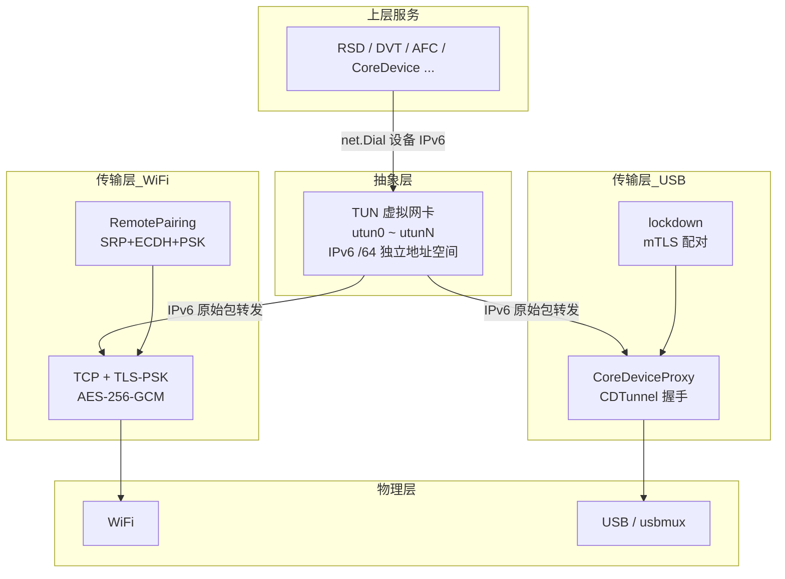
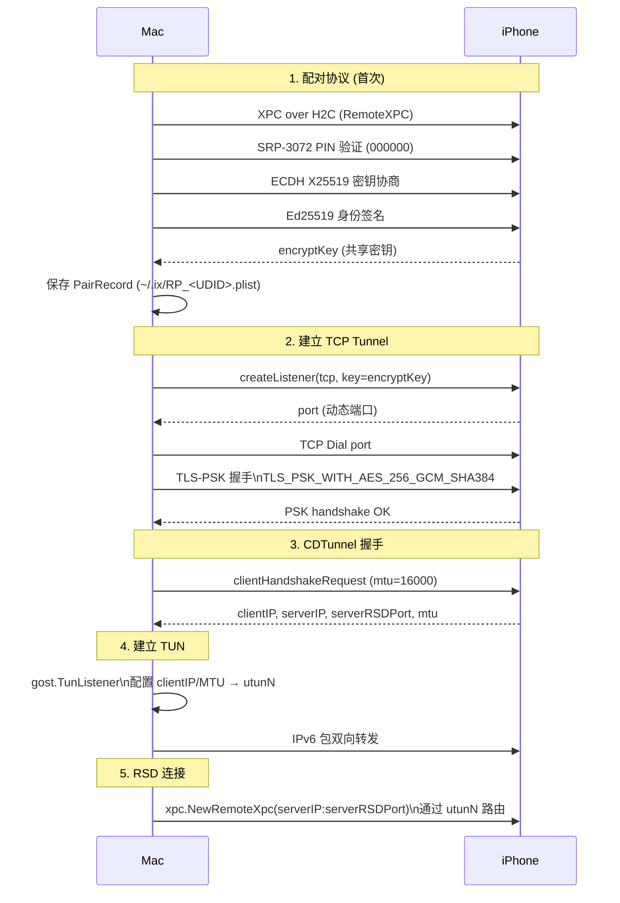
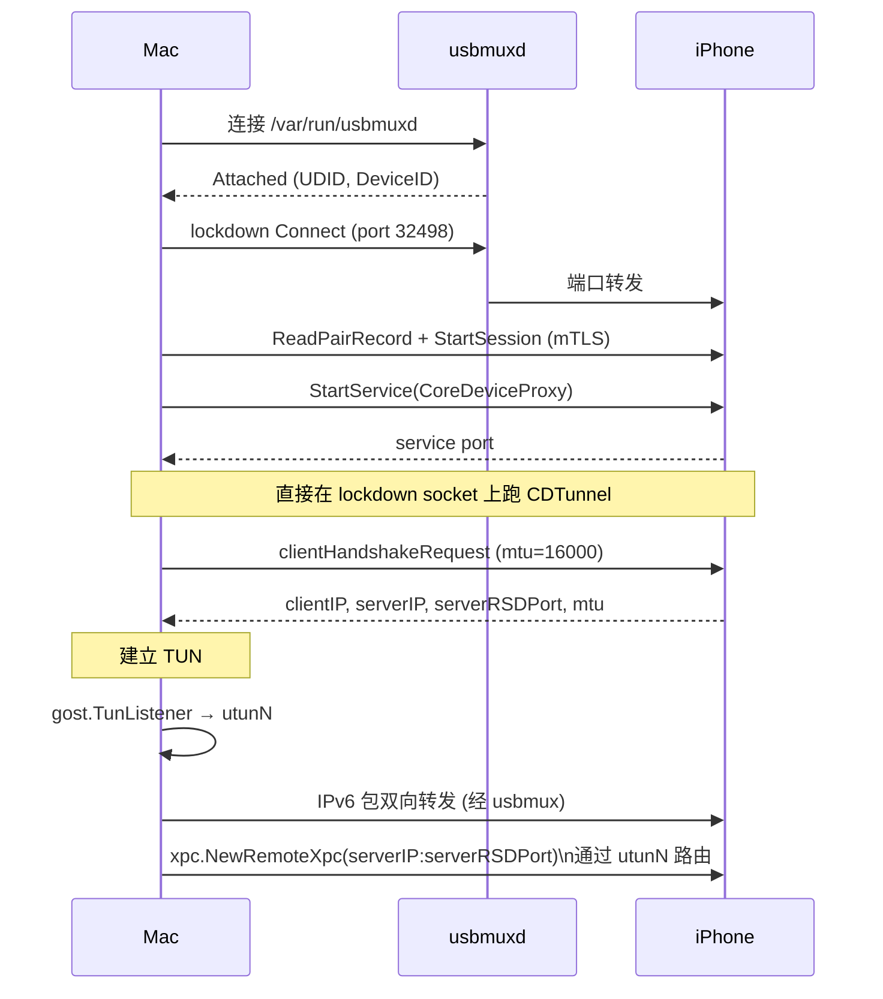
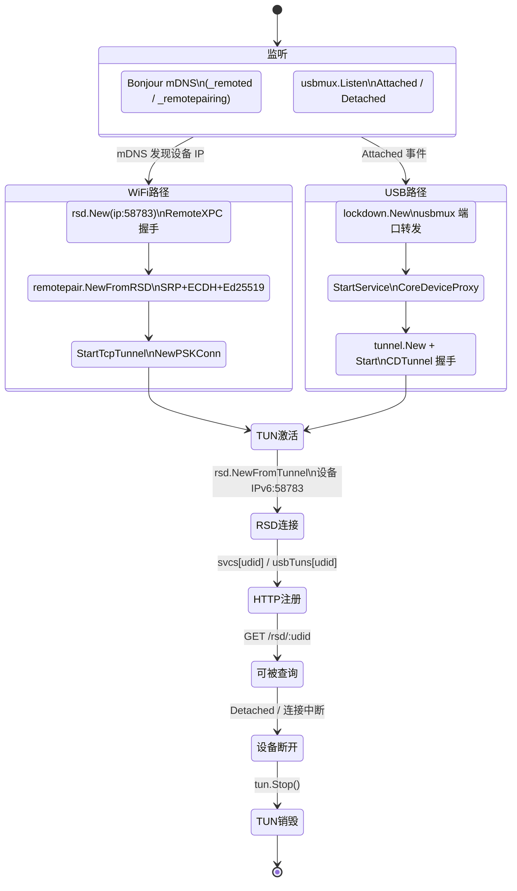
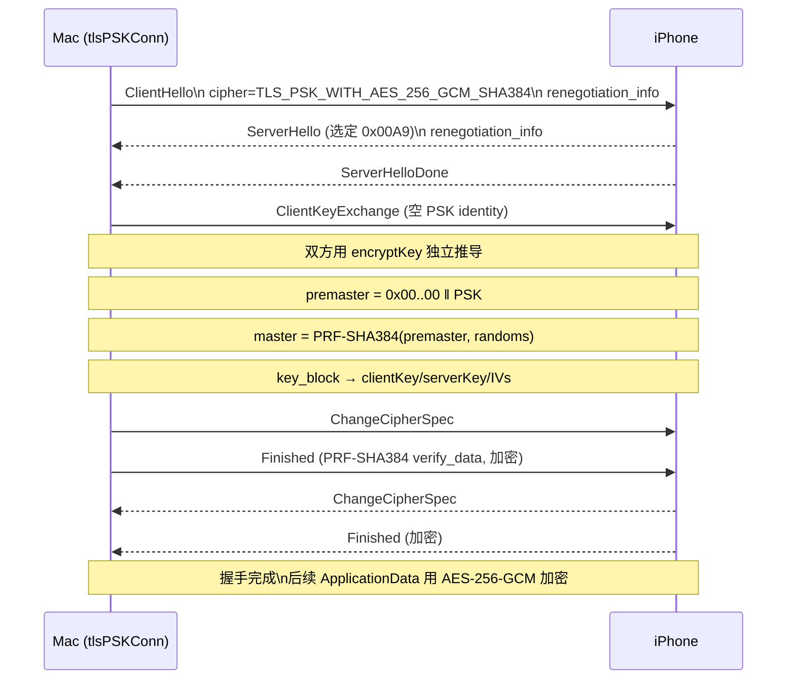
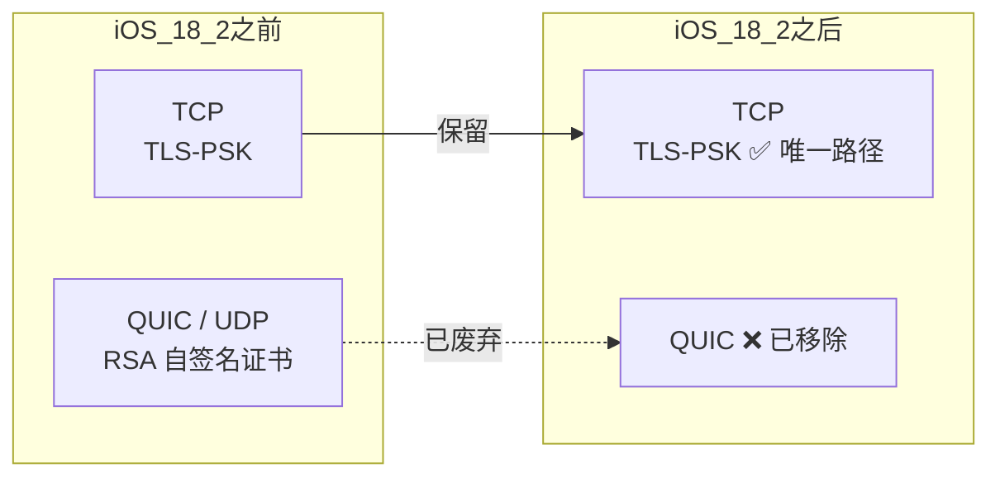

# CoreDevice Tunnel 机制

## 核心设计思想

iOS 17+ 所有上层服务（RSD / DVT / AFC / CoreDevice …）都通过 tunneld 建立的 TUN 虚拟网卡访问设备，无论底层走 USB 还是 WiFi。

TUN 是**唯一入口**，上层服务只做 `net.Dial(设备 IPv6)`，完全不感知底层传输方式。

两条路径都需要配对：
- **WiFi**：RemotePairing（SRP + ECDH + PSK），pair record 存于 `~/.ix/`
- **USB**：lockdown 配对（读取 pair record + mTLS session），再 `StartService(CoreDeviceProxy)`

### USB 访问权限分层

USB 连接本身只提供最基础的 usbmuxd 通道，访问能力取决于配对状态：

| 状态 | 可访问 | 不可访问 |
|------|--------|----------|
| 未配对（仅 usbmux 连接） | `QueryType` 等极少数接口 | 设备数据、服务启动、文件系统 |
| 配对后（lockdown mTLS session） | 完整 lockdown 服务、`StartService`、设备信息、AFC、DVT … | — |

因此 `lockdown.New()` 是 USB 路径上一切有意义操作的前提，缺少 pair record 或配对未被信任时无法继续。

---

## 整体架构

---

## WiFi 路径：RemotePairing + TCP + PSK

---

## USB 路径：lockdown 配对 + CoreDeviceProxy

---

## tunneld 服务发现与生命周期

---

## TLS-PSK 握手详情 (TCP 路径专用)

---

## 传输模式对比

iOS 18.2+ QUIC 路径被 Apple 移除，TCP + PSK 是**唯一可用**的 WiFi tunnel 传输方式。

实测（iOS 26.6.1 / iPhone16,2）：QUIC 握手返回 `CRYPTO_ERROR 0x128`（TLS handshake_failure），设备直接拒绝，自动降级到 TCP+PSK 正常工作。

---

## 关键文件索引

| 文件 | 职责 |
|---|---|
| `api/remotepair/tlspsk.go` | 纯 Go TLS-PSK 实现（TLS 1.2，0x00A9） |
| `api/remotepair/pskconn.go` | `NewPSKConn` 入口，调 `newPSKConn` |
| `api/remotepair/remotepair.go` | SRP/ECDH/Ed25519 配对 + `StartTcpTunnel` |
| `api/remotepair/connection.go` | `wirePairConnection` / `wifiPairConnection` |
| `api/tunnel/tunnel.go` | CDTunnel 握手 + TUN 创建 + IPv6 转发 |
| `api/tunnel/rsd/rsd.go` | RSD 连接（通过 TUN 后的设备 IPv6） |
| `api/tunnel/xpc/remote.go` | RemoteXPC over H2C |
| `api/tunnel/h2c/h2c.go` | 裸 HTTP/2 帧层（非标准 HTTP） |
| `api/tunneld/tunneld.go` | daemon：Bonjour + USB 发现，管理 tunnel 生命周期 |
| `api/lockdown/lockdown.go` | USB lockdown 配对 + StartService |
